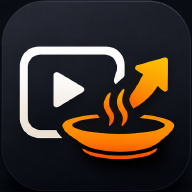

<div align="center">
  
  <h1>videorecipe</h1>
  <p><b>Turn any YouTube cooking video into a clean, structured recipe.</b><br/>A Flutter app that pulls a video's transcript and uses Claude to extract ingredients, steps, timing and tips — no more scrubbing through the video.</p>
  <p>
    <a href="LICENSE"></a>
    
    
    
    
  </p>
</div>

---

Extract structured recipes from YouTube cooking videos. Paste a video, and the app pulls its transcript, sends it to a small backend, and hands you a clean recipe — ingredients, steps, timing and tips — instead of scrubbing through the video.

## How it works

1. The **Flutter** app fetches the transcript of a YouTube cooking video (`youtube_explode_dart`).
2. It posts the transcript to the **PHP backend**, a thin proxy that keeps the Anthropic API key server-side.
3. The backend asks **Anthropic Claude** to turn the transcript into structured recipe JSON (dish name, ingredients, steps, difficulty, servings, tips).
4. The app renders the recipe and caches it locally (Hive).

## Tech

- **App:** Flutter / Dart, Riverpod (state), Dio (networking), Hive (local storage), RevenueCat (`purchases_flutter`) for subscriptions. Targets iOS and Android.
- **Backend:** PHP proxy exposing `POST /api/extract-recipe` and `GET /api/health`, with CORS, rate limiting, transcript-size caps and Anthropic Claude integration. See [`backend/README.md`](backend/README.md).

## Run

### App

```bash
flutter pub get
flutter run
```

### Backend

```bash
cd backend
composer install
cp .env.example .env       # add your ANTHROPIC_API_KEY
php -S localhost:8000 -t public
```

Point the app at the backend URL, then open a YouTube cooking video to extract its recipe.

## License

Released under the [MIT License](LICENSE) © 2026 Olivier Lüthy. You're free to use, modify and distribute this
software, including commercially, as long as the copyright notice and license are included.

## Author

Built by **Olivier Lüthy** — [GitHub](https://github.com/olivierluethy).
